# Lab7_php_dasar

1. Membuat File dengan nama Php_dasar
2. Menambahkan Variabel php

	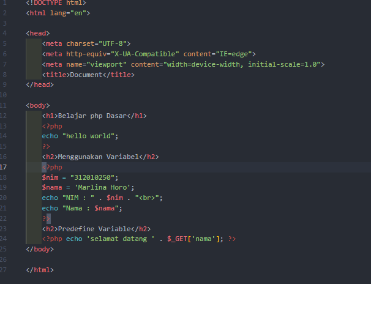

3. hasilnya

	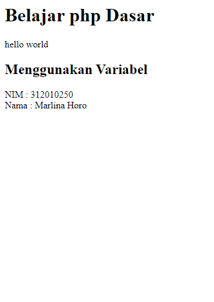

4. membuat Form input 

	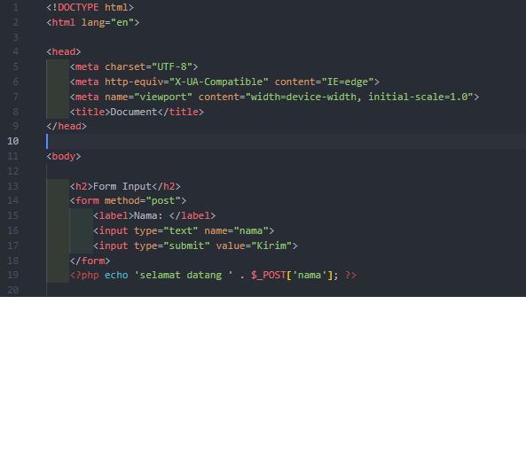

5. hasilnya

	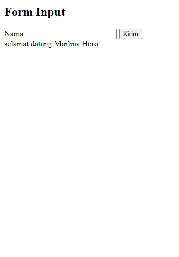

6. menambahkan operator

	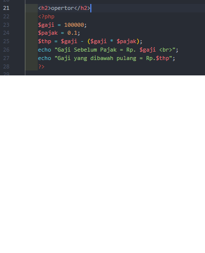
	

7. hasil

	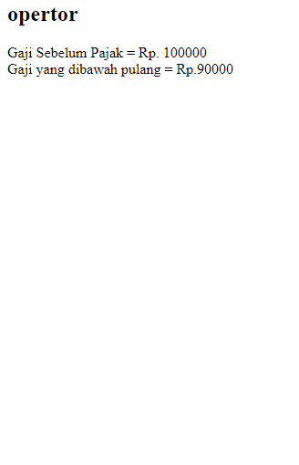

8. Menambahkan Kondisi IF dan Switch

	
	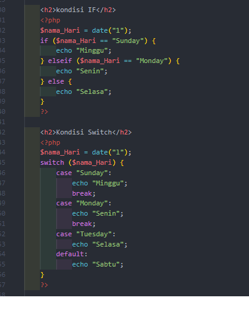

9. hasil

	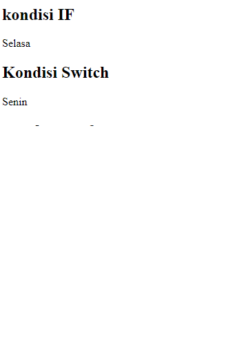

10. perulangan for

	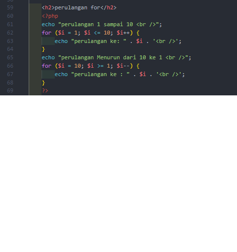

11. hasil

	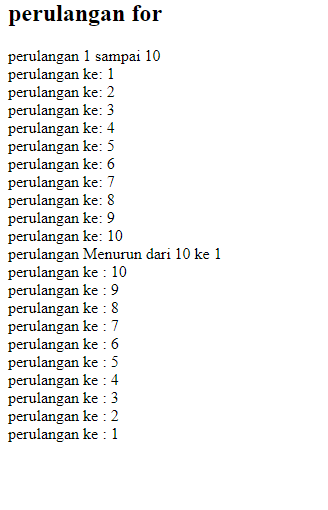

12. perulangan while dan doWhile
	

	
	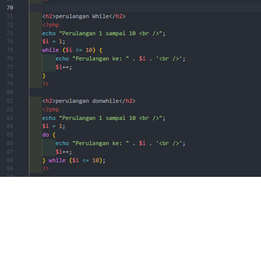

13. hasil

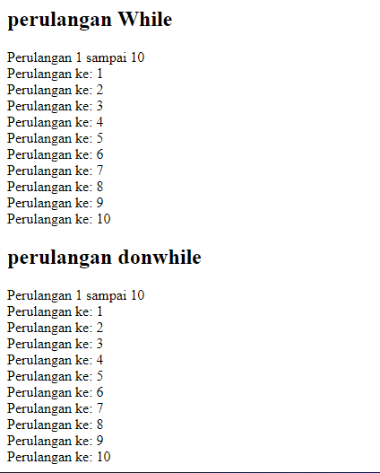

